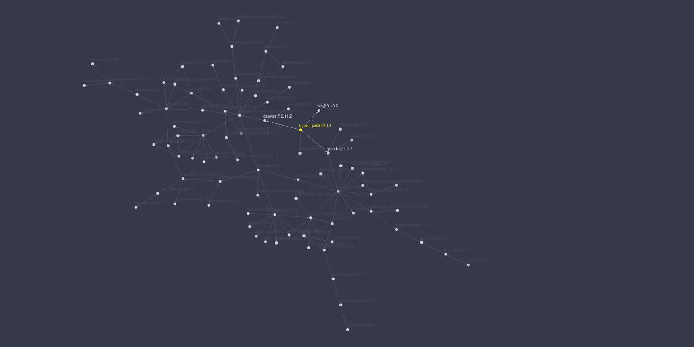

<div class="center-col h-full text-center">

# Оптимизируем зависимости

</div>

---
layout: default
---

# dev vs prod


````md magic-move
```json
{
	"dependencies": {
		"vue": "^3.5.13",
		"vue-router": "^4.5.0",
		"@rushstack/eslint-patch": "^1.8.0",
		"@vitejs/plugin-vue": "^5.0.5",
		"@vue/eslint-config-prettier": "^9.0.0",
		"@vue/test-utils": "^2.4.6",
		"cypress": "^13.12.0",
		"eslint": "^8.57.0",
		"eslint-plugin-cypress": "^3.3.0",
		"eslint-plugin-vue": "^9.23.0",
		"vite": "^5.3.1",
		"vitest": "^1.6.0"
	}
}
```

```json
{
	"dependencies": {
		"vue": "^3.5.13",
		"vue-router": "^4.5.0"
	},
	"devDependencies": {
		"@rushstack/eslint-patch": "^1.8.0",
		"@vitejs/plugin-vue": "^5.0.5",
		"@vue/eslint-config-prettier": "^9.0.0",
		"@vue/test-utils": "^2.4.6",
		"cypress": "^13.12.0",
		"eslint": "^8.57.0",
		"eslint-plugin-cypress": "^3.3.0",
		"eslint-plugin-vue": "^9.23.0",
		"vite": "^5.3.1",
		"vitest": "^1.6.0"
	}
}
```
````

---

# Устраняем одинаковые библиотеки

````md magic-move
```json {all|5,7}
{
	"dependencies": {
		"vue": "^3.5.13",
		"vue-router": "^4.5.0",
		"vue-draggable": "^2.0.6",
		"js-sha256": "^0.11.0",
		"vue-draggable-next": "^2.2.1",
		"crypto-js": "^4.2.0"
	}
}
```

```json
{
	"dependencies": {
		"vue": "^3.5.13",
		"vue-router": "^4.5.0",
		"js-sha256": "^0.11.0",
		"vue-draggable-next": "^2.2.1",
		"crypto-js": "^4.2.0"
	}
}
```
````

---

# Удаляем библиотеки, которые предоставляют фичи языка


````md magic-move
```json {all|5,7}
{
	"dependencies": {
		"vue": "^3.5.13",
		"vue-router": "^4.5.0",
		"js-sha256": "^0.11.0",
		"vue-draggable-next": "^2.2.1",
		"crypto-js": "^4.2.0"
	}
}
```

```json
{
	"dependencies": {
		"vue": "^3.5.13",
		"vue-router": "^4.5.0",
		"vue-draggable-next": "^2.2.1",
		"crypto-js": "^4.2.0"
	}
}
```

```json
{
	"dependencies": {
		"vue": "^3.5.13",
		"vue-router": "^4.5.0",
		"vue-draggable-next": "^2.2.1"
	}
}
```
````

---

# Удаляем мусор

<v-clicks>

## - `isEven`
## - `isOdd`
## - deprecated-библиотеки
## - библиотеки с уязвимостями
## - бутстрап
## - и т. д.

</v-clicks>


---

# Waterline

<div class="center-col" style="gap: 32px;">

<QRCode
    :width="300"
    :height="300"
    type="svg"
    data="http://npm.anvaka.com/#/view/2d/waterline"
    :dotsOptions="{ type: 'rounded', color: 'white' }"
/>

## http://npm.anvaka.com/#/view/2d/waterline

</div>

---

# Зависимости LaranaJS

<div class="center-col">
	
</div>

<v-click>

<Arrow x1="442" y1="160" x2="442" y2="260" color="yellow"/>

</v-click>

---

# Vue Vapor Mode

<div class="center-col" style="gap: 32px;">

<QRCode
    :width="300"
    :height="300"
    type="svg"
    data="https://www.vuemastery.com/blog/the-future-of-vue-vapor-mode"
    :dotsOptions="{ type: 'rounded', color: 'white' }"
/>

## https://www.vuemastery.com/blog/the-future-of-vue-vapor-mode

</div>
