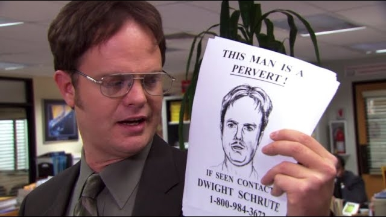
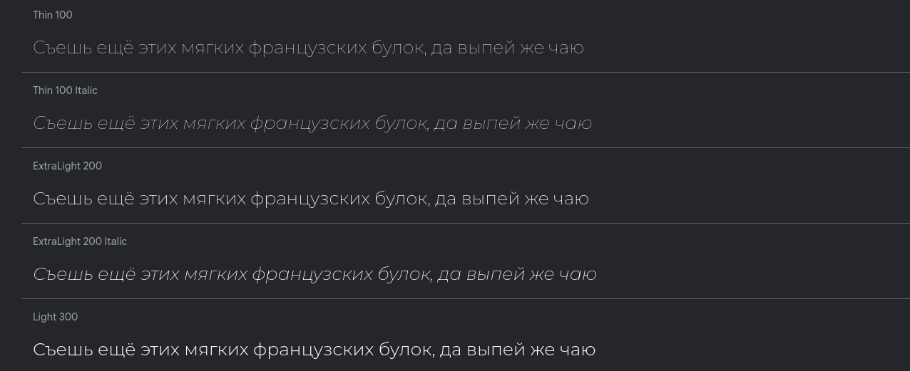
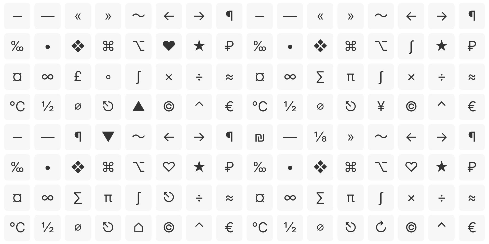

# Шрифты: fallback

	

---

# Шрифты: fallback

<QRCode
    :width="300"
    :height="300"
    type="svg"
    data="https://www.cssfontstack.com/"
    :dotsOptions="{ type: 'rounded', color: 'white' }"
/>

## https://www.cssfontstack.com/

---

# Шрифты: Удаление лишних стилей

---

# Шрифты: Удаление лишних глифов

---

# Шрифты: Удаление лишних глифов

## 330.9 kB -> 172,3 kB

 

## ~50%

<QRCode
    :width="300"
    :height="300"
    type="svg"
    data="https://fontforge.org"
    :dotsOptions="{ type: 'rounded', color: 'white' }"
/>

## https://fontforge.org

