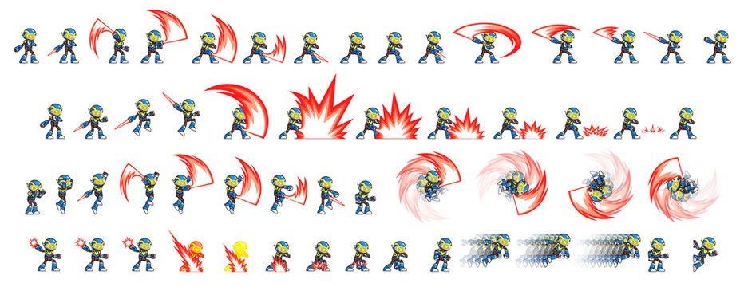

# SVGO

<div style="display: flex; gap: 32px;">

<div style="flex: 1;">

````md magic-move
```html
<?xml version="1.0" encoding="utf-8"?>
<svg
	width="800px"
	height="800px"
	viewBox="0 0 16 16"
	fill="none"
	xmlns="http://www.w3.org/2000/svg"
>
	<path fill-rule="evenodd" clip-rule="evenodd" d="..." fill="#000000"/>
	<g></g>
	<g></g>
	<g></g>
	<g></g>
	<g></g>
</svg>
```

```html
<?xml version="1.0" encoding="utf-8"?>
<svg
	width="800px"
	height="800px"
	viewBox="0 0 16 16"
	fill="none"
	xmlns="http://www.w3.org/2000/svg"
>
	<path fill-rule="evenodd" clip-rule="evenodd" d="..." fill="#000000"/>
</svg>
```
````

</div>

<div class="center-col" style="gap: 32px; flex: 1;">
<QRCode
    :width="300"
    :height="300"
    type="svg"
    data="https://www.npmjs.com/package/svgo"
    :dotsOptions="{ type: 'rounded', color: 'white' }"
/>

## svgo on npm

</div>

</div>


---

# Спрайты


