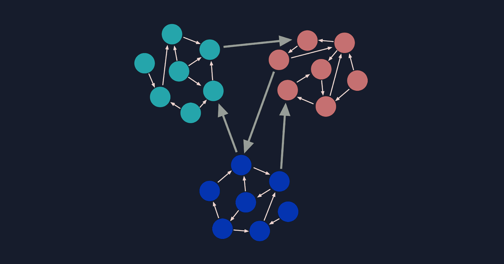
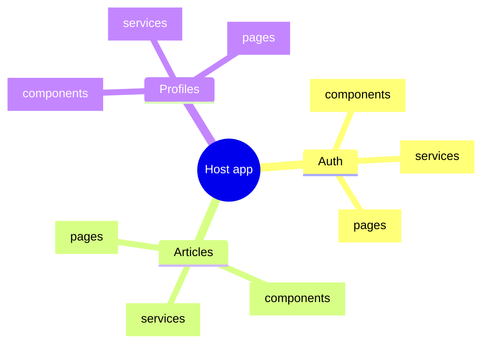
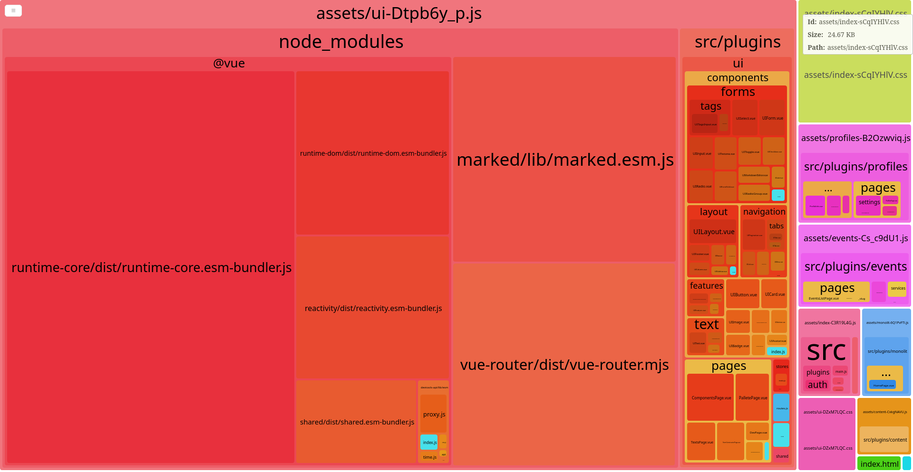

# Lazy loading изображений

```vue {all|3|13}
<template>
	<div>
		
		<h1>Lorem impsum dolor</h1>
		<p>
			Lorem ipsum dolor sit amet, consectetur adipiscing elit, sed do eiusmod tempor
			incididunt ut labore et dolore magna aliqua. Ut enim ad minim veniam, quis nostrud
			exercitation ullamco laboris nisi ut aliquip ex ea commodo consequat. Duis aute irure
			dolor in reprehenderit in voluptate velit esse cillum dolore eu fugiat nulla pariatur.
			Excepteur sint occaecat cupidatat non proident, sunt in culpa qui officia deserunt
			mollit anim id est laborum
		</p>
		
	</div>
</template>
```

---

# Lazy loading страниц

```js {all|6|7}
// router.js
import { createRouter } from 'vue-router'

const router = createRouter({
	routes: [
		{ path: '/', component: HomePage },
		{ path: '/users/:id', component: () => import('./views/UserDetails.vue') },
	],
})
```

---

# Manual chunks

```js
// vite.config.js
export default defineConfig({
	build: {
		rollupOptions: {
			// https://rollupjs.org/guide/en/#outputmanualchunks
			output: {
				manualChunks: {
					'group-user': [
						'./src/UserDetails',
						'./src/UserDashboard',
						'./src/UserProfileEdit',
					],
				},
			},
		},
	},
})
```

---

# Low coupling / high cohesion

<div class="center-col">
	
</div>

---

# Разбиваем на модули

<v-clicks depth="2">

## - По функционалу: Админка / Личный кабинет / Лендинг

## - По устройствам: Десктоп / Мобилка

## - По доступам: Публичное / Приватное

</v-clicks>

---


# Разбиваем на модули



---

# vite-bundle-analyzer




---

# <span class="red">Warning</span>: Плагины для Vue

```js
// plugins/ui/index.js

import * as components from '@/plugins/ui/components'

export const UIPlugin = {
	install(app, _) {
		for (const [key, value] of Object.entries(components)) {
			app.component(kebabize(key.replace('UI', 'ui')), value)
		}
	},
}
```

```js
// main.js
import { createApp } from 'vue'
import { UIPlugin } from '@/plugins/ui'

const app = createApp(App)

app.use(UIPlugin)
```

---

# <span class="red">Warning</span>: Интернационализация

<v-click>

## <span class="red">Плохо</span>: глобальный словарь

```js
import { localDict1 } from 'my-module1'
import { localDict2 } from 'my-module2'

export const globalDict = {
	...localDict1,
	...localDict2,
}
```

```js
import { t } from 'global-i18n'

console.log(t('localDict.key'))
```

</v-click>

<v-click>

## <span class="green">Хорошо</span>: локальные словари

```js
import { t } from 'local-i18n'

console.log(t('key'))
```

</v-click>
