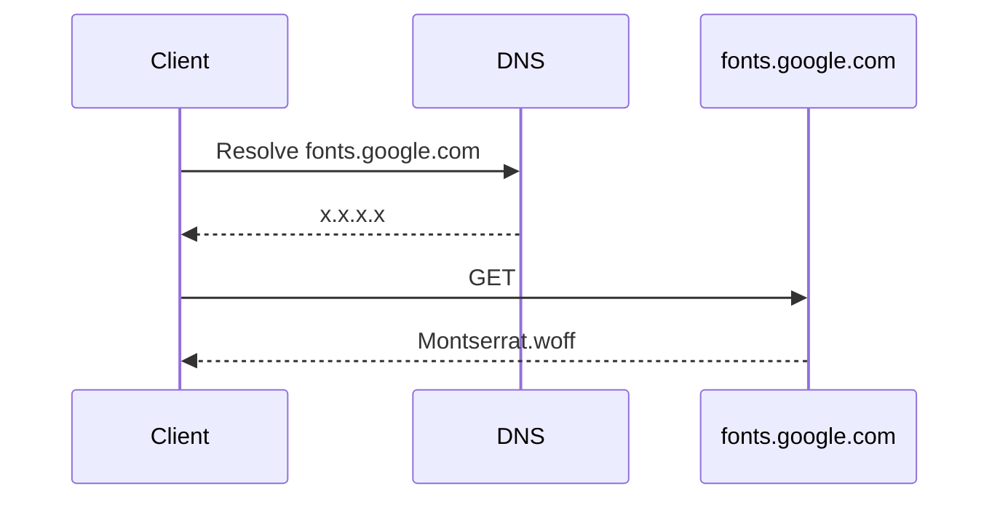
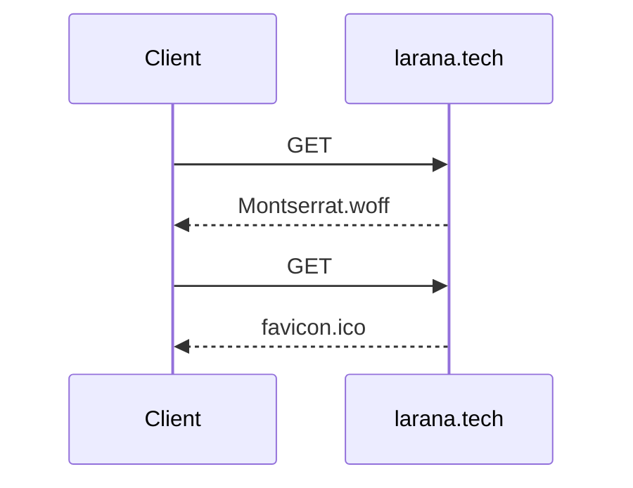

# Protocols

<v-click>

## HTTP/1

> Один большой файл лучше нескольких файлов поменьше

 

</v-click>

<v-click>

## HTTP/2

> Несколько файлов поменьше лучше одного большого

 

</v-click>

<v-click>

## HTTP/3 (HTTP-over-QUIC)

> Как HTTP/2, но решает некоторые проблемы и ускоряет TLS-handshake

</v-click>

---
transition: fade
---

# Self-hosting файлов

---

# Self-hosting файлов

